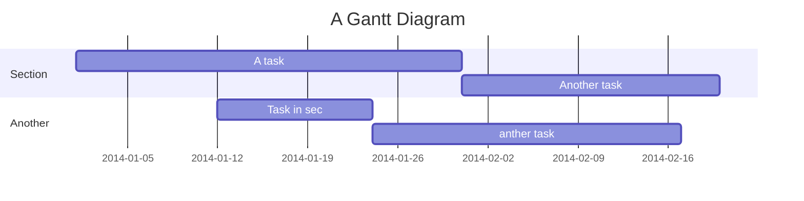

Action items
===

Table of Contents
---

[TOC]

SWUNG
---

If you are a total beginner to this, start here!

* Prepare introduction for SWUNG newcomers
* 

Diversity, equality, inclusion
---

* TBD

> I choose a lazy person to do a hard job. Because a lazy person will find an easy way to do it. [name=Bill Gates]

Cloud computing
---

* Set up AWS permission policies
* Get in touch with the GeoLatinas group
* Set up JupyterHub or Pangeo

Technology
---

* Set up Jitsi server for video calls

Project Timeline (from existing template)
---

> Read more about mermaid here: http://mermaid-js.github.io/mermaid/

## Appendix and FAQ

:::info
**Find this document incomplete?** Leave a comment!
:::

###### tags: `ToDo`
